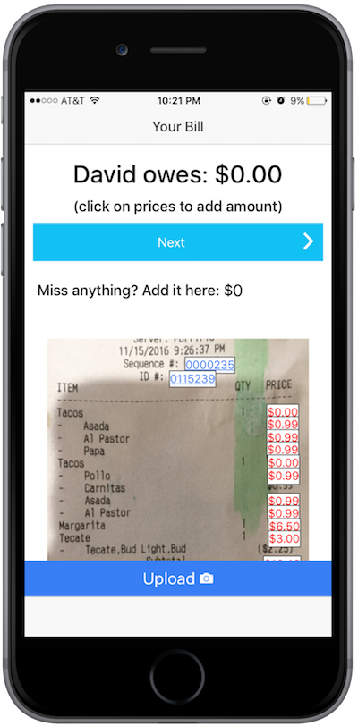

# BillSplit

### An Ionic app for IOS that allows restaurant goers to split the bill

A user enters the names of people eating and takes a picture of a receipt. The prices on the receipt can then be manipulated to add costs to each person eating. Once tax and tip are added, the app displays how much each person eating should pay.

## To use the app

You can view a prototype of the app in my [web version](https://salty-fortress-17530.herokuapp.com), or check out its full functionality (with camera) in Ionic View by sending me a request at davidjwe33@gmail.com

### Development process

Technologies used: Ionic, Angular, OCR API, Node with Express, MongoDB, AWS, HTML/CSS

## User Stories

As a user, I can easily add the people I am splitting the bill with

As a user, I can take a picture of a receipt and add the prices to what a certain person owes

As a user, I can add custom prices in case the picture did not capture all the ones I need

As a user, I can add tax and tip

As a user, I can see the results of the bill being split appropriately

## Future implementations

* Paypal Authentication

* Users who log in with Paypal can view their history of receipts

* Back buttons and/ore reset buttons in case a user clicks the wrong prices

* Line through number when it is clicked
* Options to add a discount
